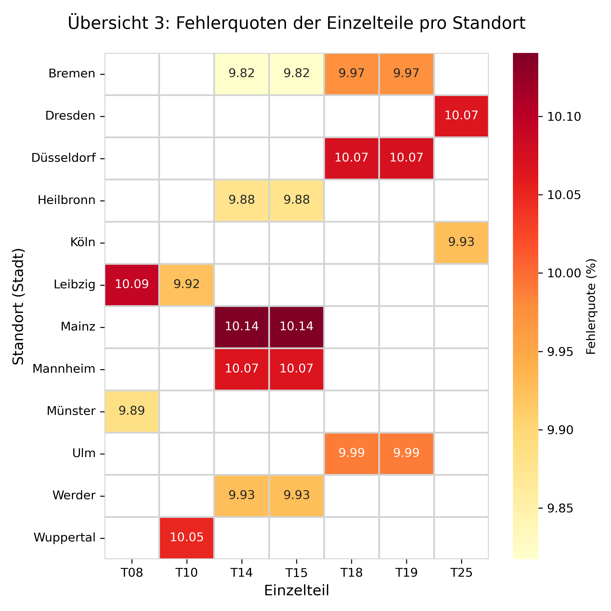

# 🏭 Manufacturing Analytics: IIoT Fehlerquoten-Optimierung

## 📌 Projektübersicht
Im Rahmen einer Industrial Internet of Things (IIoT)-Initiative verzeichnete ein namhafter Automobilhersteller ungewöhnlich hohe Mängel bei der Herstellung diverser Einzelteile in verschiedenen Werken. 

Ziel dieses Projekts war die Entwicklung einer automatisierten **ETL-Pipeline (Extract, Transform, Load)** zur Konsolidierung der fragmentierten Produktionsdaten sowie die Durchführung einer explorativen Datenanalyse (EDA), um präzise zu identifizieren, wo und warum diese Produktionsfehler auftreten.

## 🗄️ Datengrundlage & Herausforderungen
Der Rohdatensatz bestand aus **7 separaten, unstrukturierten CSV-Dateien** mit insgesamt **über 3,56 Millionen Datensätzen**. 
Bei der Bereinigung der Daten wurden folgende Data-Engineering-Herausforderungen mittels Python gelöst:
* **Inkonsistentes Schema:** Die Identifikationsspalten der Werke waren inkonsistent benannt (z. B. `Werksnr` vs. `Werksnummer`).
* **Fehlende Daten (Imputation):** In einem Datensatz (T15) fehlten die Werksstandorte (Städtenamen) komplett. Dies wurde gelöst, indem dynamisch ein relationales Mapping-Dictionary aus den anderen Tabellen aufgebaut wurde, um die fehlenden Werte anhand der Primärschlüssel zu ergänzen.
* **Gemischte Datentypen:** Die Produktionsdaten enthielten unterschiedliche String-Formate (z. B. `YYYY-MM-DD` vs. `DD.MM.YYYY`), die programmatisch vereinheitlicht werden mussten.
* **Encoding-Probleme:** Um fehlerhafte Zeichensätze bei deutschen Umlauten (ä, ö, ü) zu vermeiden, wurde die Dekodierung spezifisch auf `latin1` angepasst.

## ⚙️ Methodik & Technologien
1. **Datenintegration:** Entwicklung eines robusten Python-Skripts mit `pandas` zum dynamischen Einlesen, Bereinigen und Zusammenfügen der 7 Datensätze in einen Master-DataFrame.
2. **Datenaggregation:** Gruppierung der 3,5 Millionen Zeilen nach Einzelteil und Werksstandort zur Berechnung der exakten Fehlerquoten.
3. **Datenvisualisierung:** Nutzung von `matplotlib` und `seaborn` zur Generierung von gruppierten Balkendiagrammen und Heatmaps (Wärmebildkarten) für das Management-Reporting.

## 📊 Zentrale Business-Insights

*(Hinweis: Die Heatmap visualisiert die Fehlerquoten der 7 Komponenten über 9 verschiedene Werksstandorte hinweg.)*

Durch die Transformation der Daten in eine Heatmap konnten drei entscheidende Erkenntnisse für das Management abgeleitet werden:

1. 🚨 **Der schwächste Standort:** Das Werk in **Mainz** weist signifikante Performance-Lücken auf. Bei der Produktion der Komponenten T14 und T15 liegt die Fehlerquote bei extremen **10,14 %** – dem höchsten Wert im gesamten Unternehmensnetzwerk.
2. 🏆 **Der Benchmark-Standort:** Das Werk in **Bremen** ist firmenweiter Vorreiter in der Qualitätskontrolle. Die Fehlerquote für exakt dieselben Komponenten (T14 & T15) liegt dort bei lediglich **9,82 %**. 
   * *Handlungsempfehlung:* Führungskräfte der Qualitätssicherung aus Mainz sollten nach Bremen entsandt werden, um die dortigen Produktionsprozesse zu studieren.
3. 🔗 **Verborgene Produktionskorrelationen:** Die Daten offenbaren eine 100-prozentige Korrelation zwischen bestimmten Bauteil-Paarungen. Beispielsweise weisen T14 und T15 an *jedem* Standort identische Fehlerquoten auf (z. B. 9,82 % in Bremen, 10,14 % in Mainz). Die exakt gleiche statistische Anomalie zeigt sich bei den Teilen T18 und T19. 
   * *Fazit:* Diese Teile werden höchstwahrscheinlich auf derselben Produktionslinie gefertigt oder nutzen denselben Rohstofflieferanten. Ein Fehler beim einen Teil führt zwangsläufig zu einem Fehler beim anderen.

## 🚀 Ausführung des Codes
1. Klonen Sie dieses Repository.
2. **[Laden Sie die Rohdaten (ZIP) hier herunter](https://drive.google.com/file/d/1Ru-D_dJ13yexj2ZlCFmkU4uSh0WTrmLo/view?usp=sharing)**
3. Entpacken Sie die ZIP-Datei und legen Sie die 7 CSV-Dateien in dasselbe Verzeichnis wie das Python-Skript.
4. Führen Sie das Jupyter Notebook `manufacturing_analysis.ipynb` aus, um den ETL-Prozess zu starten und alle Visualisierungen lokal zu generieren.
